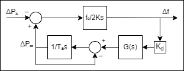
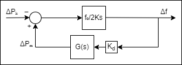

## Sampler

To sample and aggregate data from a raw cvs file to a new cvs that can be read by objective_function.py, de_run.py, etc.  
`$ python src/sampler.py [-h] -i INPUT [-o OUTPUT] [-st SAMPLING_TIME] [-et EVENT_TIME] [-nf NOMINAL_FREQUENCY]`

Raw files are sampled each $0.02$ seconds (this is assumed to be true in `sampler.py`). Absolute timestmaps are given. The number of `CL_` columns is not fixed.  
| Time       | Stamp           | CL_Concepción_UDEC | CL_Santiago_USACH | CIO       | Potencia | Inicio |
|------------|-----------------|--------------------|-------------------|-----------|----------|--------|
| 2021-05-31 | 19:52:00.000000 | 50.044199          | 50.043982         | 50.043722 | 300      | 1710   |
|  |  |  |  |  |  |  |  

Aggregated files are sampled each `-t` seconds ($0.3$ by default). Differences to nominal frequency ($f_0=50Hz$ by default) are recorded $\Delta f_t = f_t-f_0$. Relative time is given. The event column is `1` after **Inicio** and `0` again after `SAMPLING_TIME` if specified. 
| time | delta_freq | event | power | f0 |
|------|-------------|-------|-------|----|
|	0	   | -0.127162	 | 0     | 146	 | 50 |
|	0.3  | -0.127132	 | 0     | 146	 | 50 |
| ...  | ...         | ...   | ...   |    |

## Models

Currently three models are available. Two models from [1] (p19) given by the diagram  
  
Whith correspondig functions; `model b` $G(s) = \frac{1+T_cs}{1+T_bs}$, and `model c` $G(s) = \frac{1+T_ds}{1+T_cs+T_bs^2}$. And a `model cc` whith the latter function but omiting the $T_a$ block as in the diagram  
  
In all cases we relabel the constant $H=\frac{f_0}{2K}$ for ease of notation.
## Fitting

To run [differential evolution](https://docs.scipy.org/doc/scipy/reference/generated/scipy.optimize.differential_evolution.html) over an aggregated file do:  
`python src/de_run.py [-h] -i INPUT_FILE [-o OUTPUT_DIR] [-m MODEL] [-p PARAMETERS]`  
The `PARAMETERS` can be `popsize,mutation,recombination` or `popsize,mutation,recombination,maxiter,tol` if nonspecified, defaults are 
| `popsize` | `mutation` | `recombination` | `maxiter` | `tol` |
|-|-|-|-|-|
| 15 | .75 | .7 | 1000 | 0.01 |

If `OUTPUT_DIR` is given, result and convergence plot are generated there, and the result object is [pickled](https://docs.python.org/3/library/pickle.html#data-stream-format)

## Configuración automática via iracepy

Ver https://github.com/auto-optimization/iracepy para detalles de instalación de irace.

## Energía cinética de los datos en `./data/test/`:
Esta informacion se obtuvo de los csv en raw o de otro lado? donde? 

`13/02/2023  14:08 -> K = 45.7 GWs`  
`13/02/2023  22:37 -> K = 57.7 GWs`  
